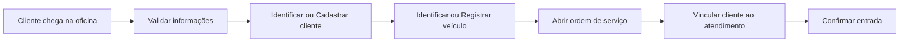
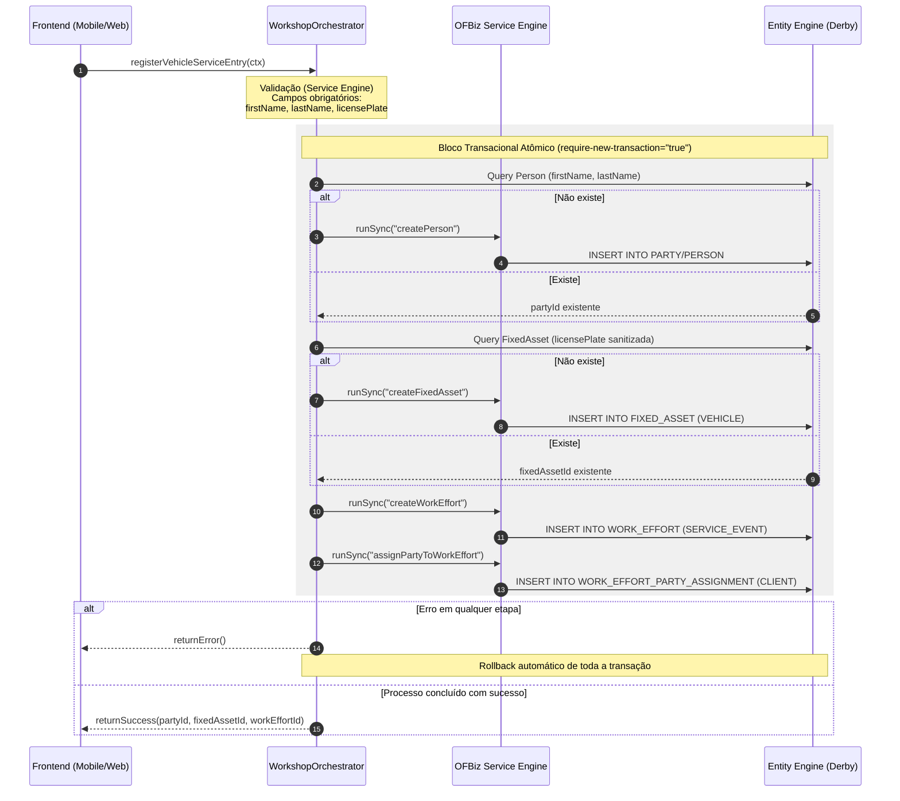

# ⚙️ Khepri Orchestrator: Enterprise Process Orchestration

[](https://adoptium.net/)
[](https://ofbiz.apache.org/)
[](http://www.apache.org/licenses/LICENSE-2.0)

O **Khepri Orchestrator** é um plugin de engenharia de software desenvolvido para o ecossistema **Apache OFBiz**. Ele atua como uma camada de **BFF (Backend for Frontend)** e **Facade**, especificamente desenhado para a automação de processos na [Oficina Mecânica Tuaregue](https://grupo-tuaregue.ueniweb.com/) (Atibaia-SP).

## 🏢 O Cliente: Tuaregue Automotiva

A [Tuaregue Automotiva](https://grupo-tuaregue.ueniweb.com/) é uma oficina especializada em mecânica geral e ar-condicionado localizada em Atibaia-SP. O projeto Khepri foi concebido para resolver desafios logísticos e transacionais específicos desta operação.

## 🚨 O Problema: OFBiz "Puro" vs. Realidade da Oficina

O Apache OFBiz é um ERP industrial poderoso, mas seu uso direto (Out-of-the-Box) gerava atritos operacionais graves:

* **Burocracia na Recepção:** O cadastro fragmentado de clientes e veículos exigia múltiplas interações em entidades distintas (`Party`, `FixedAsset`), tornando o processo lento e propenso a erros.
* **Execução sem Garantia Física:** O sistema padrão permitia iniciar serviços sem a reserva física de peças no estoque, resultando em paradas não planejadas na oficina.
* **Fuga de Receita:** Riscos de liberação de veículos sem a devida validação de faturas e pagamentos.

## 🛠️ A Solução: Orquestração e Consistência

O Khepri atua como o maestro do ERP, interceptando intenções de negócio e orquestrando as regras internamente sob uma única transação:

* **Cadastro Atômico (One-Click) com Idempotência:** Orquestra a criação ou recuperação de `Person` e `FixedAsset`, gerando o `WorkEffort` (Atendimento) de forma transacional. Implementa a lógica "Find or Create" para evitar inflação de dados.
* **Sanitização de Inputs:** Tratamento rigoroso de placas de veículos (uppercase/trim) para garantir a integridade das buscas.
* **Trava de Estoque:** Implementa validação rígida via `khepriVerifyPartsAvailability`, impedindo que uma Ordem de Serviço avance sem a reserva de estoque (`OrderItemShipGrpInvRes`) equivalente a 100% da necessidade.
* **Gate Pass (Bloqueio Financeiro):** Condiciona a liberação física do veículo à integridade financeira das faturas vinculadas.

#### Fluxos do Processo de Entrada de Veículo

Este documento apresenta dois níveis de visualização do processo de entrada de veículo na oficina:

- **Fluxo Didático:** visão simplificada orientada ao negócio.
- **Fluxo Técnico:** visão arquitetural detalhada do backend e persistência.

---

## 1. Fluxo Didático (Visão de Negócio)

Este fluxo representa o processo de forma simples e acessível para pessoas não técnicas.



---

## 2. Fluxo Técnico (Visão Arquitetural)

Este fluxo detalha a comunicação entre frontend, camada orquestradora (BFF), motor de serviços do OFBiz e persistência no banco de dados, destacando o isolamento transacional.



---

# Conceitos Importantes

## WorkshopOrchestrator (BFF)

Camada responsável por:

* Validar dados recebidos (exclusão de nulos para campos críticos).
* Normalizar inputs (ex: placas em caixa alta).
* Orquestrar chamadas de serviço com lógica "Find or Create".
* Garantir consistência transacional e auditabilidade via logs técnicos.

## OFBiz Service Engine

Responsável pela execução dos serviços nativos e customizados:

* Execução síncrona (`runSync`).
* Verificação de permissões via Groovy scripts.
* Gestão do ciclo de vida dos serviços.

## Entity Engine

Camada de persistência responsável por:

* Operações de banco de dados (CRUD).
* Controle transacional rigoroso (Atomicidade).
* Garantia de integridade referencial (Chaves Estrangeiras).

---

# Garantia Transacional

Todo o processo ocorre dentro de uma única transação atômica isolada (`require-new-transaction="true"`). Isso significa que:

* Se qualquer etapa falhar (erro de validação, erro de banco ou permissão),
* Todas as operações anteriores são desfeitas automaticamente (rollback),
* Garantindo que o banco de dados nunca contenha dados parciais ou fragmentados.

---

## 🏗️ Arquitetura

O Khepri é um **Plugin Nativo** integrado ao `Service Engine` e `Entity Engine` do Apache OFBiz:

* **Design Pattern:** Atua como um **BFF / Facade Layer**, expondo serviços de alto nível que abstraem a complexidade do modelo `Party/WorkEffort/Asset`.
* **Tecnologias:** Java 17 e Groovy.
* **Persistência:** Utiliza o modelo transacional nativo do OFBiz, garantindo rollback automático em caso de falhas parciais na orquestração.
* **Namespace:** `org.tuaregue.khepri` para conformidade com padrões Java.

## 🚦 Status do Projeto

* [x] Estrutura base do plugin (v24.09).
* [x] Orquestração da Recepção (Cadastro Atômico: Cliente + Veículo + OS).
* [x] Idempotência e Sanitização de Dados.
* [x] Modernização: Migração de Permissões para Groovy.
* [x] Validação Técnica de Estoque (Trava de segurança).
* [ ] Fluxo de Aditivo de Orçamento.
* [ ] Validação de Pagamento vs. Liberação (Gate Pass).

## 🧪 Engenharia de Qualidade (QA)

O projeto conta com uma suíte de testes integrados baseada em `OFBizTestCase`:

* **`InventoryValidationTests`:** Valida que a oficina não inicie serviços sem peças reservadas fisicamente e trata cenários de ordens inexistentes.
* **`WorkshopOrchestratorTests`:** Valida o fluxo atômico de recepção, garantindo a idempotência de pessoas/ativos e verificando se o rollback ocorre corretamente em falhas de validação.

## 💻 Como Rodar (Desenvolvimento)

### 1. Instalação

Certifique-se de que o diretório do plugin se chama `khepri-orchestrator` dentro da pasta `plugins` do OFBiz.

### 2. Carga de Dados (Obrigatório)

Execute da raiz do projeto OFBiz para carregar tipos, status e permissões semente:

```bash
./gradlew "ofbiz --load-data readers=seed,seed-initial,ext-test component=khepri-orchestrator"

```

### 3. Execução dos Testes Automatizados

```bash
./gradlew clean ofbiz --test component=khepri-orchestrator --test suitename=KhepriTests

```

### 4. Iniciar o Servidor

```bash
./gradlew ofbiz

```

## 🔍 Troubleshooting

* **NoClassDefFoundError:** Certifique-se de que as classes estão no pacote `org.tuaregue.khepri` e execute `./gradlew clean`.
* **Erro de Constraint (FK) no WorkEffort:** Verifique se o status `PRTYASGN_ASSIGNED` está presente na base (carregue o leitor `ext-test`).
* **ServiceValidationException nos testes:** É o comportamento esperado para testes negativos. A suíte foi configurada para capturar essas exceções.

