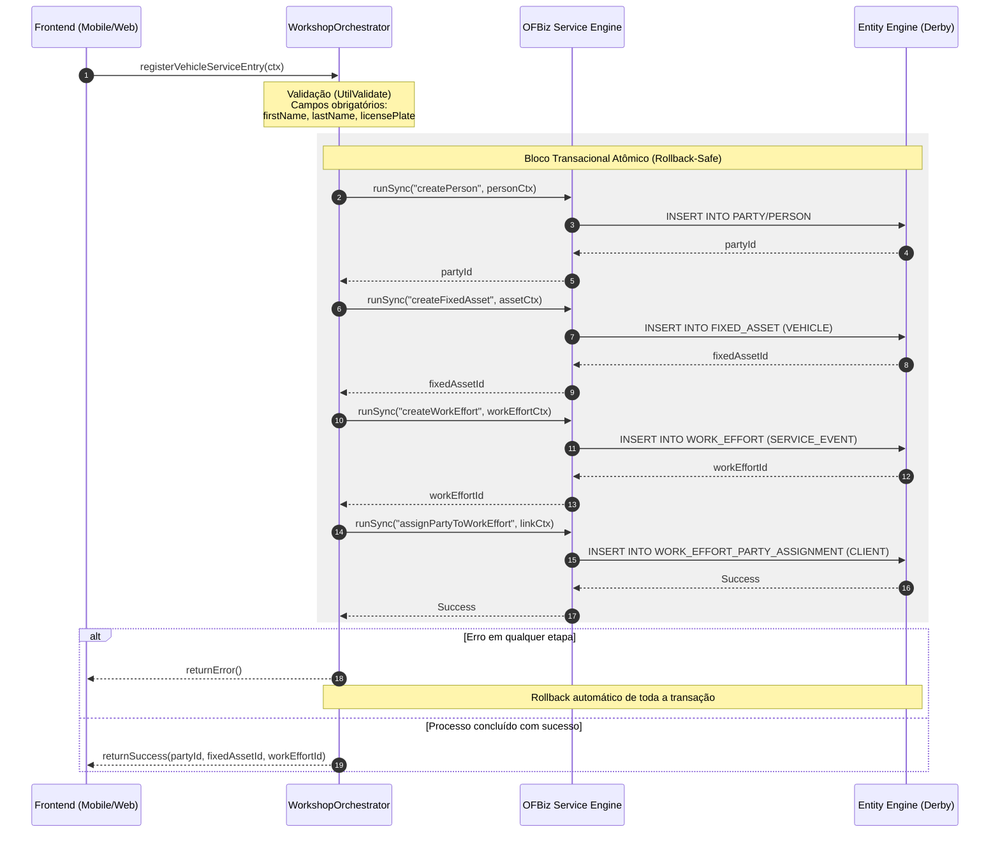

# ⚙️ Khepri Orchestrator: Enterprise Process Orchestration


[](https://adoptium.net/)
[](https://ofbiz.apache.org/)
[](http://www.apache.org/licenses/LICENSE-2.0)

O **Khepri Orchestrator** é um plugin de engenharia de software desenvolvido para o ecossistema **Apache OFBiz**. Ele atua como uma camada de **BFF (Backend for Frontend)** e **Facade**, encapsulando a alta complexidade relacional do ERP em fluxos transacionais atômicos, especificamente desenhados para a automação de processos na **Oficina Mecânica Tuaregue** (Atibaia-SP).

## 🚨 O Problema: OFBiz "Puro" vs. Realidade da Oficina

O Apache OFBiz é um ERP industrial poderoso, mas seu uso direto (Out-of-the-Box) gerava atritos operacionais graves:

* **Burocracia na Recepção:** O cadastro fragmentado de clientes e veículos exigia múltiplas interações em entidades distintas (`Party`, `FixedAsset`), tornando o processo lento e propenso a erros.
* **Execução sem Garantia Física:** O sistema padrão permitia iniciar serviços sem a reserva física de peças no estoque, resultando em paradas não planejadas na oficina.
* **Fuga de Receita:** Riscos de liberação de veículos sem a devida validação de faturas e pagamentos.

## 🛠️ A Solução: Orquestração e Consistência

O Khepri atua como o maestro do ERP, interceptando intenções de negócio e orquestrando as regras internamente sob uma única transação:

* **Cadastro Atômico (One-Click):** Orquestra a criação de `Person`, `FixedAsset` e gera o `WorkEffort` (Atendimento) de forma transacional através do serviço `registerVehicleServiceEntry`.
* **Trava de Estoque:** Implementa validação rígida via `khepriVerifyPartsAvailability`, impedindo que uma Ordem de Serviço avance sem a reserva de estoque (`OrderItemShipGrpInvRes`) equivalente a 100% da necessidade.
* **Gate Pass (Bloqueio Financeiro):** Condiciona a liberação física do veículo à integridade financeira das faturas vinculadas.

#### Fluxos do Processo de Entrada de Veículo

Este documento apresenta dois níveis de visualização do processo de entrada de veículo na oficina:

- **Fluxo Didático:** visão simplificada orientada ao negócio.
- **Fluxo Técnico:** visão arquitetural detalhada do backend e persistência.

---

## 1. Fluxo Didático (Visão de Negócio)

Este fluxo representa o processo de forma simples e acessível para pessoas não técnicas.


---

## 2. Fluxo Técnico (Visão Arquitetural)

Este fluxo detalha a comunicação entre frontend, camada orquestradora (BFF), motor de serviços do OFBiz e persistência no banco de dados.


---

# Conceitos Importantes

## WorkshopOrchestrator (BFF)

Camada responsável por:

* Validar dados recebidos
* Orquestrar chamadas de serviço
* Garantir consistência transacional
* Centralizar regras compostas de negócio

---

## OFBiz Service Engine

Responsável pela execução dos serviços nativos do OFBiz, como:

* Cadastro de pessoas
* Registro de ativos
* Criação de atendimentos
* Relacionamentos entre entidades

---

## Entity Engine

Camada de persistência responsável por:

* Operações de banco de dados
* Controle transacional
* Mapeamento entidade-relacional

---

# Garantia Transacional

Todo o processo ocorre dentro de uma única transação atômica.

Isso significa que:

* Se qualquer etapa falhar,
* Todas as operações anteriores são desfeitas automaticamente (rollback),
* Garantindo integridade dos dados.

```
```


## 🏗️ Arquitetura

O Khepri é um **Plugin Nativo** integrado ao `Service Engine` e `Entity Engine` do Apache OFBiz:

* **Design Pattern:** Atua como um **BFF / Facade Layer**, expondo serviços de alto nível que abstraem a complexidade do modelo `Party/WorkEffort/Asset`.
* **Tecnologias:** Java 17 e Groovy.
* **Persistência:** Utiliza o modelo transacional nativo do OFBiz, garantindo rollback automático em caso de falhas parciais na orquestração.

## 🚦 Status do Projeto

- [x] Estrutura base do plugin (v24.09).
- [x] Orquestração da Recepção (Cadastro Atômico: Cliente + Veículo + OS).
- [x] Validação Técnica de Estoque (Trava de segurança).
- [ ] Fluxo de Aditivo de Orçamento.
- [ ] Validação de Pagamento vs. Liberação (Gate Pass).

## 🔌 Serviços Principais (API de Orquestração)

* **`registerVehicleServiceEntry`:** Consolida os dados do solicitante e do veículo, criando o vínculo de atendimento em uma única chamada atômica.
* **`khepriVerifyPartsAvailability`:** Serviço de validação que checa a integridade física do estoque antes de permitir o início da execução de uma OS.

## 🧪 Engenharia de Qualidade (QA)

Atualmente, o projeto conta com 16 casos de teste automatizados baseados em `OFBizTestCase` e `GroovyScriptTestCase`:

* **`InventoryValidationTests`:** Valida que a oficina não inicie serviços sem peças reservadas fisicamente.
* **`WorkshopOrchestratorTests`:** Valida o fluxo atômico de recepção, incluindo cenários de rollback em caso de dados inválidos.

## 💻 Como Rodar (Desenvolvimento)

### 1. Instalação
Certifique-se de que o diretório do plugin se chama `khepri-orchestrator` dentro da pasta `plugins` do OFBiz.

### 2. Carga de Dados (Obrigatório)
Execute da raiz do projeto OFBiz para carregar tipos e dados semente:
```bash
./gradlew "ofbiz --load-data readers=seed,seed-initial,demo component=khepri-orchestrator"
```

### 3. Execução dos Testes Automatizados
```bash
./gradlew :ofbiz --args="--test component=khepri-orchestrator --test suitename=KhepriTests"
```

### 4. Iniciar o Servidor
```bash
./gradlew ofbiz
```

## 🔍 Troubleshooting

* **Erro de Constraint (FK) no WorkEffort:** Certifique-se de carregar o `seed data` para incluir os tipos `SERVICE_EVENT` e `WE_CREATED`.
* **Cannot locate service:** Verifique se o plugin está em `plugins/khepri-orchestrator` e se o serviço está registrado nos arquivos `servicedef/services_*.xml`.
```
